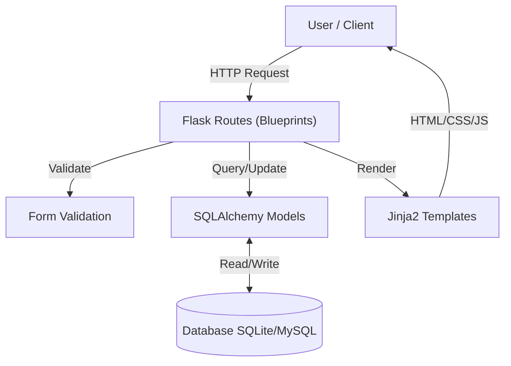
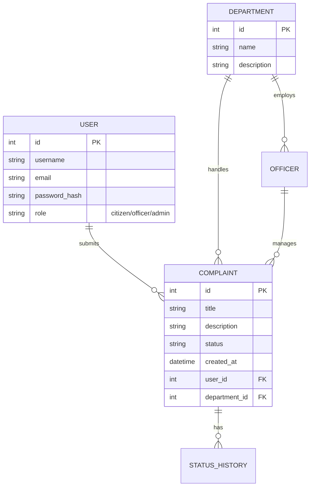

# Civic Complaint Tracking System

> **"Together for a cleaner, safer community."**

A comprehensive, full-stack web platform designed to bridge the gap between citizens and municipal authorities. This system streamlines the process of reporting, tracking, and resolving civic issues, ensuring transparency and accountability in public administration.

[](https://civic-complaint-system.onrender.com)

[](https://www.python.org/)
[](https://flask.palletsprojects.com/)

---

## 👥 The Team

Designed and developed by a dedicated team of student developers:

*   **Alwerad Khan**
*   **Naeem Jan**
*   **Hassan Khan**

---

## 🏗️ System Architecture

The application follows a modular **Model-View-Controller (MVC)** architecture powered by Flask Blueprints for scalability and maintainability.



### 🗄️ Database Schema

The database is normalized to ensure data integrity and efficient querying.



---

## ⚡ Key Features

### For Citizens
*   **Secure Authentication**: Personal accounts to manage complaints.
*   **Easy Reporting**: Submit complaints with detailed descriptions and categorizations.
*   **Real-time Tracking**: Monitor status changes from "Received" to "Resolved".
*   **Status History**: View the complete timeline of actions taken on a complaint.

### For Officers
*   **Department Dashboard**: View only complaints assigned to your specific department.
*   **Workflow Management**: Update statuses and add official remarks.
*   **Workload Overview**: Quick stats on pending vs. resolved issues.

### For Administrators
*   **System Oversight**: View all complaints across all departments.
*   **User Management**: Create and manage officer accounts.
*   **Department Control**: Add or modify municipal departments.
*   **Analytics**: Visual charts showing resolution rates and department performance.

---

## 🛠 Tech Stack

| Component | Technology | Description |
| :--- | :--- | :--- |
| **Backend** | Python (Flask) | Robust, lightweight web framework. |
| **Database** | SQLAlchemy ORM | Database abstraction layer (SQLite dev / MySQL prod). |
| **Frontend** | Bootstrap 5 | Responsive, mobile-first UI framework. |
| **Templating** | Jinja2 | Dynamic HTML rendering. |
| **Security** | Werkzeug / Flask-Login | Password hashing and session management. |
| **Visualization** | Chart.js | Interactive data visualization for admin dashboards. |

---

## 🚀 Local Installation

Want to run this project locally? Follow these steps:

1.  **Clone the Repository**
    ```bash
    git clone https://github.com/alwerad01/CCTRS.git
    cd CCTRS
    ```

2.  **Create Virtual Environment**
    ```bash
    # Windows
    python -m venv venv
    venv\Scripts\activate

    # Mac/Linux
    python3 -m venv venv
    source venv/bin/activate
    ```

3.  **Install Dependencies**
    ```bash
    pip install -r requirements.txt
    ```

4.  **Initialize Database**
    Run the included seed script to create tables and dummy data:
    ```bash
    python database/seed_data.py
    ```

5.  **Run the Application**
    ```bash
    python app.py
    ```
    Visit `http://localhost:5000` in your browser.

---

## 🔐 Default Test Credentials

If you used the seed script, you can log in with:

| Role | Username | Password |
| :--- | :--- | :--- |
| **Admin** | `admin1` | `password123` |
| **Officer** | `officer1` | `password123` |
| **Citizen** | `citizen1` | `password123` |

---


---

*Built with ❤️ for University PBL Project 2026.*
