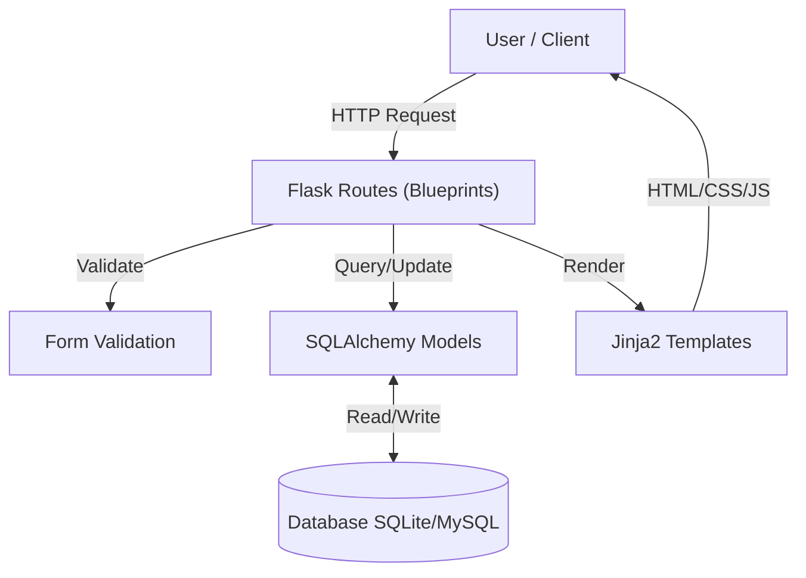
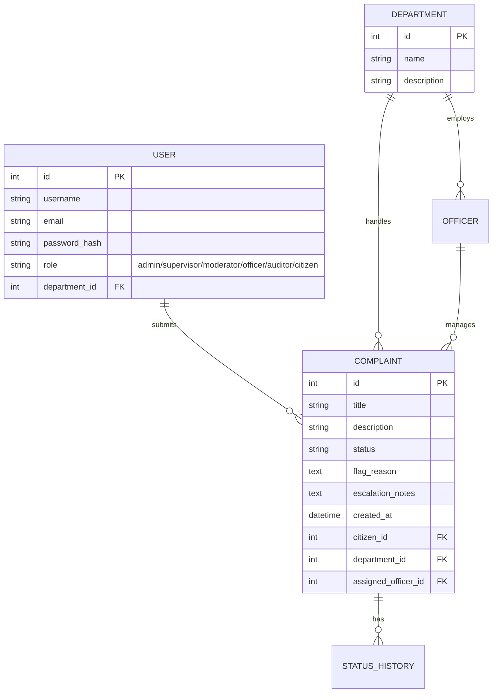
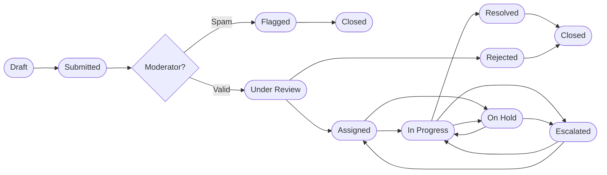

# Civic Complaint Tracking System

> **"Together for a cleaner, safer community."**

A comprehensive, full-stack web platform designed to bridge the gap between citizens and municipal authorities. This system streamlines the process of reporting, tracking, and resolving civic issues, ensuring transparency and accountability in public administration.

[](https://cctrs.onrender.com)

[](https://www.python.org/)
[](https://flask.palletsprojects.com/)

---

## 👥 The Team

CCTRS was designed and developed by a dedicated team of student developers as a university PBL project.

| | Developer | Role | Responsibilities |
| :---: | :--- | :--- | :--- |
| 👤 | **Alwerad Khan** | Lead Dev & Architect | Full-stack development · System architecture · Backend logic & security |
| 👤 | **Naeem Jan** | Research / Docs Lead | Requirements analysis · Project documentation · Academic alignment |
| 👤 | **Hassan Khan** | UI/UX Designer | Interface structure · User experience (UX) · Workflow clarity |

### 📬 Contact

| Developer | Email | Links |
| :--- | :--- | :--- |
| **Alwerad Khan** | alwerad02@gmail.com | [GitHub](https://github.com/alwerad01) · [LinkedIn](https://www.linkedin.com/in/alwerad-khan-849707249/) |
| **Naeem Jan** | naeemjaan964720@gmail.com | — |
| **Hassan Khan** | hassankhan2233kS@gmail.com | — |

---

## 🏗️ System Architecture

The application follows a modular **Model-View-Controller (MVC)** architecture powered by Flask Blueprints for scalability and maintainability.



### 🗄️ Database Schema

The database is normalized to ensure data integrity and efficient querying.



---

## ⚡ Key Features

### For Citizens
*   **Secure Authentication**: Personal accounts to manage complaints.
*   **Draft Saving**: Save a complaint without submitting — finish it later.
*   **Easy Reporting**: Submit complaints with detailed descriptions and categorizations.
*   **File Uploads**: Attach evidence (Images, PDFs, MP4s) to complaint submissions.
*   **Location Mapping**: Pinpoint issues using an interactive Leaflet.js map.
*   **Public Feed & Upvoting**: Choose to make complaints public for others to see and upvote.
*   **Post-Resolution Feedback**: Rate the service (1-5 stars) and leave remarks once a complaint is closed.
*   **Real-time Tracking**: Monitor status changes across the full 11-stage lifecycle.
*   **Status History**: View the complete timestamped timeline of every action taken.
*   **Submit Drafts**: Convert saved drafts to official submissions with one click.

### Universal Features (All Users & Staff)
*   **Professional Dashboards**: All user tables powered by DataTables.js for instant search, sorting, and pagination.
*   **Visual Analytics**: Admin and Supervisor dashboards feature Chart.js data visualizations.
*   **Premium Authentication**: Modern, split-screen login and registration pages with gradient branding and password visibility toggles.
*   **Smart Notifications**: Get pinged whenever a complaint you submitted or manage changes status.
*   **User Profiles**: Every user (staff and citizen) can set their phone number and primary address.

### For Officers
*   **Department Dashboard**: View only complaints assigned to your specific department.
*   **Lifecycle Management**: Move complaints through the full workflow with enforced valid transitions.
*   **Add Remarks**: Add official notes explaining each status change.
*   **Audit Trail**: Every transition is logged with the officer's name and timestamp.

### For Moderators *(new)*
*   **Verification Queue**: Review all Submitted complaints before they reach officers.
*   **Verify**: Approve valid complaints and forward them to the department (→ Under Review).
*   **Flag**: Mark spam or duplicate complaints with a reason (→ Flagged).

### For Supervisors *(new)*
*   **Department Oversight**: Monitor all unresolved complaints in their department.
*   **Officer Workload**: Visual overview of how many open cases each officer has.
*   **Escalation**: Escalate stalled complaints to admin attention (→ Escalated).

### For Auditors *(new)*
*   **Read-Only Access**: View all complaints across all departments — no edit capability.
*   **Filter by Status**: Quickly find complaints at any lifecycle stage.
*   **Full Audit Trail**: See who made every transition and when, including their role.

### For Administrators
*   **System Oversight**: View all complaints and access all staff role views.
*   **User Management**: Create accounts for all 6 staff roles + citizens.
*   **Department Control**: Add or modify municipal departments.
*   **Analytics**: Charts showing per-stage counts, department performance, and role distribution.
*   **Admin Override**: Admins can access moderator, supervisor, and auditor views directly.

### For Guests *(no login)*
*   **Public Stats Page**: Visit `/public` to see anonymized complaint counts and resolution rates.
*   **Department Breakdown**: See how many complaints each department handles.

---

## 🔄 Complaint Lifecycle (11 Stages)



| Stage | Who Acts | Description |
| :--- | :--- | :--- |
| **Draft** | Citizen | Saved locally, not yet visible to anyone |
| **Submitted** | Citizen | Officially submitted — enters moderation queue |
| **Flagged** | Moderator | Marked as spam/invalid — cannot proceed |
| **Under Review** | Moderator | Verified — forwarded to department |
| **Assigned** | Officer/Admin | Allocated to a responsible officer |
| **In Progress** | Officer | Active resolution work underway |
| **On Hold** | Officer | Paused — waiting on parts, approvals, or info |
| **Escalated** | Supervisor | Stalled — escalated to admin attention |
| **Resolved** | Officer | Issue addressed and solution communicated |
| **Rejected** | Officer/Admin | Invalid, out of scope, or unactionable |
| **Closed** | Admin | Fully completed — no further action |

---

## 🏛️ Municipal Departments (8)

| Department | Responsibilities |
| :--- | :--- |
| **Public Health** | Hospitals, clinics, disease outbreaks, water contamination |
| **Parks & Recreation** | Public parks, playgrounds, greenery, public events |
| **Public Works** | Roads, street lights, drainage, public building maintenance |
| **Sanitation** | Garbage collection, street cleaning, sewer maintenance |
| **Traffic** | Traffic signals, road signage, accident response, public transport |
| **Water & Sewerage** | Clean water supply, leakage repairs, sewerage maintenance |
| **Electricity** | Power outages, street lighting, transformer issues |
| **Local Police** | Neighbourhood safety, non-emergency complaints, public security |

---

## 🛠 Tech Stack

| Component | Technology | Description |
| :--- | :--- | :--- |
| **Backend** | Python (Flask) | Robust, lightweight web framework. |
| **Database** | SQLAlchemy ORM | Database abstraction layer (SQLite dev / MySQL prod). |
| **Frontend** | Bootstrap 5 | Responsive, mobile-first UI framework. |
| **Templating** | Jinja2 | Dynamic HTML rendering. |
| **Security** | Werkzeug / Flask-Login | Password hashing and session management. |
| **Visualization** | Chart.js | Interactive data visualization for admin dashboards. |

---

## 🐳 Docker Installation (Recommended)

The easiest way to start the project without worrying about Python versions or virtual environments is using Docker Compose.

```
🐳 Docker Installation
│
├── 📊 Mode Comparison Table  (Production vs Development)
│
├── 🚀 Production Mode       →  docker compose up --build -d
│   └── Stop               →  docker compose down
│
└── 🔧 Development Mode (Live Reload)
    ├── First run  →  docker compose -f docker-compose.yml -f docker-compose.dev.yml up --build
    ├── Next runs  →  docker compose -f docker-compose.yml -f docker-compose.dev.yml up
    └── No rebuild needed — edit file, save, refresh browser ✅
```

### Mode Comparison

| | Production Mode | Development Mode |
| :--- | :--- | :--- |
| **Use when** | Final demo / deployment | Active development & multiple test runs |
| **Server** | Gunicorn (fast, stable) | Flask dev server (auto-reload) |
| **Code changes** | Requires rebuild | Instant — just save & refresh |
| **Needs `--build`?** | First time only | Never (after first run) |

---

### 🚀 Production Mode
Use this for your final presentation or deployment. Runs on Gunicorn.

1. **Clone the Repository**
    ```bash
    git clone https://github.com/alwerad01/CCTRS.git
    cd CCTRS
    ```

2. **Build and Start**
    ```bash
    docker compose up --build -d
    ```

3. **Access the Application**
    Visit `http://localhost:5000` in your browser.

4. **Stop the System**
    ```bash
    docker compose down
    ```

---

### 🔧 Development Mode (Live Reload)
Use this when testing multiple changes. Any file you save is instantly reflected — **no rebuild or restart needed**.

1. **Start in Dev Mode** *(first time — builds the image)*
    ```bash
    docker compose -f docker-compose.yml -f docker-compose.dev.yml up --build
    ```

2. **Start in Dev Mode** *(subsequent runs — no rebuild needed)*
    ```bash
    docker compose -f docker-compose.yml -f docker-compose.dev.yml up
    ```

3. **Access the Application**
    Visit `http://localhost:5000` in your browser.

4. **Make Changes**
    Edit any file → save → refresh the browser. ✅ No restart required.

5. **Stop the System**
    Press `Ctrl + C` in the terminal, or run:
    ```bash
    docker compose down
    ```

> **Note:** Dev mode mounts your local project folder directly into the container and uses Flask's built-in development server with `--reload`. It is **not** suitable for production use.

---

## 🚀 Native Local Installation (Optional)

If you prefer to run the project directly on your machine without Docker, follow these steps:

1.  **Clone the Repository**
    ```bash
    git clone https://github.com/alwerad01/CCTRS.git
    cd CCTRS
    ```

2.  **Create Virtual Environment**
    ```bash
    # Windows
    python -m venv venv
    venv\Scripts\activate

    # Mac/Linux
    python3 -m venv venv
    source venv/bin/activate
    ```

3.  **Install Dependencies**
    ```bash
    pip install -r requirements.txt
    ```

4.  **Initialize Database**
    Run the included seed script to create tables and dummy data:
    ```bash
    python database/seed_data.py
    ```

5.  **Run the Application**
    ```bash
    python app.py
    ```
    Visit `http://localhost:5000` in your browser.

---

## 🔐 Default Test Credentials

If you used the seed script, you can log in with:

| Role | Username | Password | Access |
| :--- | :--- | :--- | :--- |
| **Admin** | `admin1` / `admin2` | *(private)* | Full system access + all staff views |
| **Supervisor** | `supervisor1` | `password123` | Public Works — dept oversight + escalation |
| **Supervisor** | `supervisor2` | `password123` | Sanitation dept |
| **Supervisor** | `supervisor3` | `password123` | Public Health dept |
| **Supervisor** | `supervisor4` | `password123` | Traffic dept |
| **Moderator** | `moderator1` | `password123` | Verify/flag incoming submitted complaints |
| **Officer** | `officer1` | `password123` | Public Works |
| **Officer** | `officer2` | `password123` | Sanitation |
| **Officer** | `officer3` | `password123` | Public Health |
| **Officer** | `officer4` | `password123` | Traffic |
| **Officer** | `officer5` | `password123` | Parks & Recreation |
| **Officer** | `officer6` | `password123` | Water & Sewerage |
| **Officer** | `officer7` | `password123` | Electricity |
| **Officer** | `officer8` | `password123` | Local Police |
| **Auditor** | `auditor1` | `password123` | Read-only audit view of all complaints |
| **Citizen** | `citizen1` | `password123` | Submit and track own complaints |
| **Guest** | *(no login)* | — | Visit `/public` for anonymized stats |

---


---
---

## 📄 License

This project is released under the **MIT License** — it is free and open-source software.
You are free to use, copy, modify, merge, publish, distribute, or sublicense it for any purpose, with or without attribution.

```
MIT License
Copyright (c) 2026 Alwerad Khan

Permission is hereby granted, free of charge, to any person obtaining a copy
of this software to deal in it without restriction, including without limitation
the rights to use, copy, modify, merge, publish, distribute, sublicense, and/or
sell copies of the Software.

THE SOFTWARE IS PROVIDED "AS IS", WITHOUT WARRANTY OF ANY KIND, EXPRESS OR
IMPLIED. IN NO EVENT SHALL THE AUTHORS BE LIABLE FOR ANY CLAIM, DAMAGES OR
OTHER LIABILITY, WHETHER IN AN ACTION OF CONTRACT, TORT OR OTHERWISE, ARISING
FROM, OUT OF OR IN CONNECTION WITH THE SOFTWARE OR THE USE OR OTHER DEALINGS
IN THE SOFTWARE.
```

> **⚠️ Disclaimer:** This software is provided for educational and demonstrational purposes only.
> The authors and contributors are **not responsible** for any direct, indirect, incidental,
> or consequential loss, damage, or liability arising from the use or misuse of this system
> in any real-world, production, or civic-authority environment.

---

*CCTRS — Civic Complaint Tracking & Resolution System. Open-source. Free to use.*
