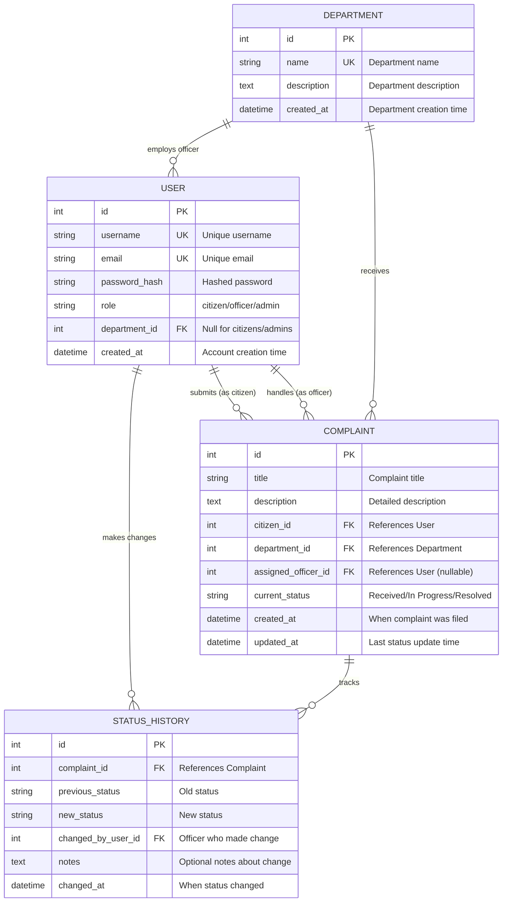

# Civic Complaint Tracking System - Entity-Relationship Diagram

## Database Schema Overview

This document presents the complete Entity-Relationship (ER) diagram for the Civic Complaint Tracking System database.

---

## ER Diagram



---

## Entity Details

### 1. USER
**Purpose**: Stores all system users (citizens, officers, and admins)

| Attribute | Type | Constraints | Description |
|-----------|------|-------------|-------------|
| id | Integer | Primary Key | Unique user identifier |
| username | String(80) | Unique, Not Null, Indexed | Login username |
| email | String(120) | Unique, Not Null | User email address |
| password_hash | String(255) | Not Null | Encrypted password |
| role | String(20) | Not Null, Default='citizen' | User role: citizen/officer/admin |
| department_id | Integer | Foreign Key (nullable) | Department assignment (officers only) |
| created_at | DateTime | Default=current timestamp | Account creation time |

**Relationships**:
- One-to-Many with `COMPLAINT` (as citizen who submits)
- One-to-Many with `COMPLAINT` (as assigned officer)
- One-to-Many with `STATUS_HISTORY` (changes made by user)
- Many-to-One with `DEPARTMENT` (officers belong to departments)

---

### 2. DEPARTMENT
**Purpose**: Represents civic departments that handle different types of complaints

| Attribute | Type | Constraints | Description |
|-----------|------|-------------|-------------|
| id | Integer | Primary Key | Unique department identifier |
| name | String(100) | Unique, Not Null | Department name |
| description | Text | Nullable | Department description |
| created_at | DateTime | Default=current timestamp | Department creation time |

**Relationships**:
- One-to-Many with `COMPLAINT` (receives complaints)
- One-to-Many with `USER` (has officers)

**Example Departments**:
- Public Works (roads, bridges, infrastructure)
- Health & Sanitation (waste management)
- Water Supply (distribution, quality)
- Electricity (power, street lights)
- Traffic Management (signals, enforcement)

---

### 3. COMPLAINT
**Purpose**: Core entity representing civic complaints filed by citizens

| Attribute | Type | Constraints | Description |
|-----------|------|-------------|-------------|
| id | Integer | Primary Key | Unique complaint identifier |
| title | String(200) | Not Null | Brief complaint title |
| description | Text | Not Null | Detailed issue description |
| citizen_id | Integer | Foreign Key, Not Null | User who filed complaint |
| department_id | Integer | Foreign Key, Not Null | Responsible department |
| assigned_officer_id | Integer | Foreign Key (nullable) | Assigned handling officer |
| current_status | String(50) | Not Null, Default='Received' | Current status |
| created_at | DateTime | Default=current timestamp, Indexed | Filing time |
| updated_at | DateTime | Auto-updated on change | Last update time |

**Status Flow**:
```
Received → In Progress → Resolved
```

**Relationships**:
- Many-to-One with `USER` (citizen)
- Many-to-One with `USER` (assigned officer)
- Many-to-One with `DEPARTMENT`
- One-to-Many with `STATUS_HISTORY` (cascade delete)

---

### 4. STATUS_HISTORY
**Purpose**: Audit trail tracking all status changes for complaints

| Attribute | Type | Constraints | Description |
|-----------|------|-------------|-------------|
| id | Integer | Primary Key | Unique history record identifier |
| complaint_id | Integer | Foreign Key, Not Null | Related complaint |
| previous_status | String(50) | Not Null | Status before change |
| new_status | String(50) | Not Null | Status after change |
| changed_by_user_id | Integer | Foreign Key, Not Null | Officer who made change |
| notes | Text | Nullable | Optional change notes |
| changed_at | DateTime | Default=current timestamp, Indexed | When change occurred |

**Relationships**:
- Many-to-One with `COMPLAINT` (tracked complaint)
- Many-to-One with `USER` (officer who made change)

---

## Database Constraints & Rules

### Referential Integrity
1. **User-Department**: Officers must belong to a department; citizens and admins have null department_id
2. **Complaint-Citizen**: Every complaint must have a valid citizen
3. **Complaint-Department**: Every complaint must be assigned to a department
4. **Complaint-Officer**: Officer assignment is optional initially, assigned when status changes
5. **Status History Cascade**: Deleting a complaint deletes all its status history records

### Business Rules
1. **Status Transitions**: Enforced by `Complaint.update_status()` method
   - Received → In Progress (only)
   - In Progress → Resolved (only)
   - Resolved → (no further changes allowed)

2. **Unique Constraints**:
   - Usernames must be globally unique
   - Emails must be globally unique
   - Department names must be unique

3. **Role-Based Permissions**:
   - Citizens: Submit and view their own complaints
   - Officers: View and update complaints in their department
   - Admins: Full access to all data, manage users and departments

---

## Indexing Strategy

For optimal query performance:

| Table | Indexed Columns | Purpose |
|-------|----------------|---------|
| USER | username | Fast login lookups |
| COMPLAINT | created_at | Efficient chronological sorting |
| STATUS_HISTORY | changed_at | Quick history retrieval |

---

## Database Technology

- **ORM**: SQLAlchemy (Python)
- **Database**: SQLite (development) / PostgreSQL or MySQL (production recommended)
- **Migration Tool**: Flask-Migrate (Alembic)
